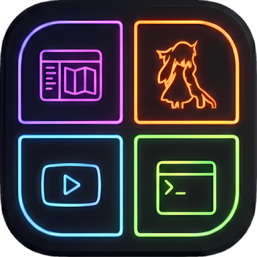

<p align="center">
  
</p>

<h1 align="center">HyprSlob Workspace Organizer</h1>


A standalone, full-screen **workspace + window exposé** for [Hyprland](https://hyprland.org/),
built with [Quickshell](https://quickshell.org/). Press a key and every monitor's workspaces fan out
on the focused screen with **live window thumbnails** — click to jump, drag to rearrange, all themed
by one rolling rainbow band.

> Part of the **HyprSlob** family, but a fully separate project from the
> [HyprSlob Center Bar](https://github.com/Waltherion/hyprslob) — its own config, its own repo.

<!-- Add your own screenshots/gif here (e.g. a screenshots/ folder) and link them. -->

## What it does

- **One unified canvas on the focused monitor** showing *all* monitors and their workspaces, stacked
  in workspace-number order, with live `ScreencopyView` thumbnails (icon fallback when previews are off).
- **Click** a window → focus it and close the exposé. **Middle-click** → close the window.
  **Click** an empty cell → switch that monitor to that workspace.
- **Drag a thumbnail** across monitors to move the window there — reliably, including onto empty
  workspaces, with no "ghost" workspaces landing on the wrong screen (see
  [`docs/FINDINGS.md`](docs/FINDINGS.md) for why this is the hard part and how it's solved).
- **Special / scratchpad workspaces** shown to the right of each monitor's grid — drag windows in and
  out; the tiles stay put even when empty so you always have a drop target.
- **Active workspace** highlight + **hover** feedback (a coloured film over the cell, on top of any
  window).
- **Rolling 45° rainbow band** running through the box border, the section headers, the workspace
  numbers and the cell outlines — or a solid accent colour when rainbow is off. Fully config-driven,
  live-reloaded.

## Requirements

- **Hyprland** with the **Lua config** (`hyprland.lua`). The organizer dispatches moves/focus via the
  `hl.dsp.*` Lua API; the classic `hyprland.conf` dispatch strings are not yet supported.
- **Quickshell** (`qs`).
- Built and tested for **multi-monitor setups using
  [split-monitor-workspaces](https://github.com/Duckonaut/split-monitor-workspaces)** (per-monitor
  workspaces). Single-monitor setups work too; standard global-workspace setups are untested.
- Optional: `grim`/`hyprshot` for your own screenshots — the app itself needs neither.

## Install

```sh
git clone https://github.com/Waltherion/hyprslob-organizer.git \
  ~/.config/quickshell/hyprslob-organizer
qs -n -c hyprslob-organizer      # runs it (idle until opened)
```

The `-n` (`--no-duplicate`) flag makes a second launch of the **same config** exit immediately,
so you never end up with two overlays stacked (e.g. autostart + a manual run, or a flaky
theme-switch restart). It's per-config — it never touches your other Quickshell instances. To
force-clear a stuck instance, use Quickshell's own registry: `qs kill -c hyprslob-organizer`.

Bind a key and open it via IPC. In `hyprland.lua`:

```lua
-- autostart (idle, -n prevents a duplicate instance)
hl.exec_cmd("qs -n -c hyprslob-organizer")

-- toggle the exposé (examples: Super+Ctrl+Tab, or Super+Å on a Danish layout)
hl.bind("SUPER + CTRL + Tab", hl.dsp.exec_cmd("qs -c hyprslob-organizer ipc call organizer toggle"))

-- (optional) blur the visible desktop behind the exposé
hl.layer_rule({ match = { namespace = "quickshell-hyprslob-organizer" }, blur = true })
hl.layer_rule({ match = { namespace = "quickshell-hyprslob-organizer" }, ignore_alpha = 0.05 })
```

IPC targets: `toggle`, `open`, `close` — e.g. `qs -c hyprslob-organizer ipc call organizer toggle`.

## Configuration

Appearance and layout come from **`~/.config/hyprslob-organizer/config.jsonc`** (JSON-with-comments,
live-reloaded on save). Without it the organizer uses sane monochrome defaults.

Copy the example to get started:

```sh
mkdir -p ~/.config/hyprslob-organizer
cp ~/.config/quickshell/hyprslob-organizer/config.example.jsonc \
   ~/.config/hyprslob-organizer/config.jsonc
```

Highlights (see [`config.example.jsonc`](config.example.jsonc) for the full set):

| Key | What it does |
|---|---|
| `rainbow` / `stops` | rolling rainbow band on/off, and its colours |
| `rainbowPeriod` / `rainbowSpeed` | band tightness and roll speed (lower period = more, tighter bands) |
| `color` | `background` / `text` / `accent` / `border` / `highlight` |
| `cornerRadius` / `borderWidth` / `font` | shape & typography |
| `overview.columns` / `spacing` / `cellGap` | grid layout |
| `overview.scale` | max zoom (raise for a bigger board on large screens) |
| `overview.backdropOpacity` | desktop dim behind the box (0 = visible, 1 = black) |
| `overview.livePreviews` / `showSpecial` / `headers` | feature toggles |

> Caveat: no `//` comments *inside* string values (paths use single-slash).

## How the cross-monitor moves work

With `split-monitor-workspaces` + non-persistent workspaces, moving a window to an **empty** workspace
on another monitor naively creates it on the *wrong* screen. The organizer always moves the window to
the target **monitor first**, then onto the target workspace — so empty cells never "ghost". The full
empirical write-up is in [`docs/FINDINGS.md`](docs/FINDINGS.md).

## Status

**v0.2** — recommends `qs -n` (`--no-duplicate`) so an autostart + manual run can't stack two
overlays; per-config, so it never touches other Quickshell instances.
**v0.1** — first public release. Functional and themed; daily-driver on the author's 2-monitor setup.

Known gaps: classic (non-Lua) Hyprland config support, dynamic-N polish for 3+ monitors, and screenshots.
Contributions and issues welcome.

## License

[GPL-3.0](LICENSE).
